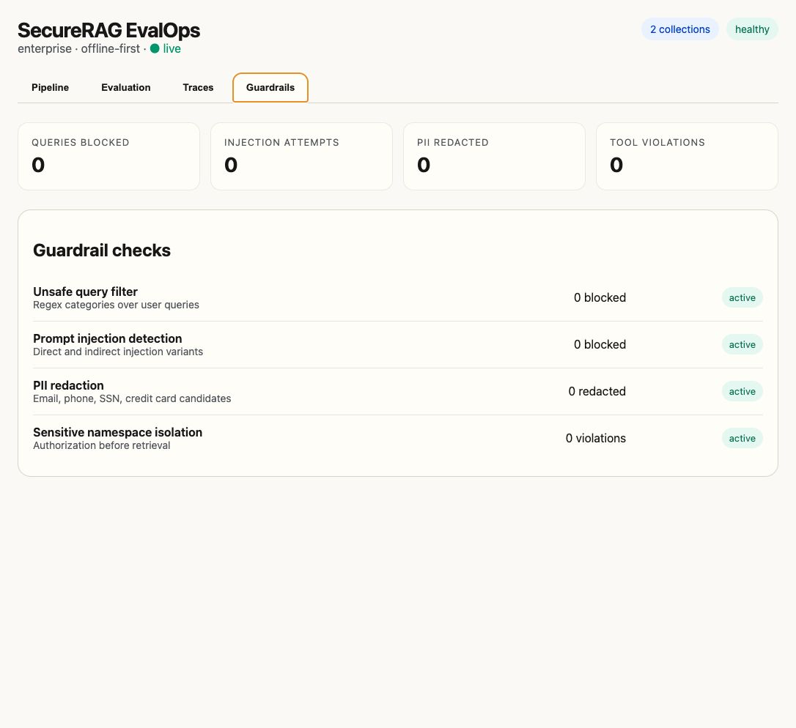

# SecureRAG EvalOps

Private-deployment RAG evaluation and guardrail platform for secure enterprise document QA.



## What this demonstrates

- structure-aware chunking, graph-augmented hybrid retrieval, and deterministic local embeddings
- namespace authorization before vector search
- API-key authentication, audit logging, request limits, and production readiness checks
- MMR reranking and citation-grounded extractive generation
- deterministic evaluation, guardrails, PII redaction, tracing, and cost tracking

## Architecture

```text
files -> parser -> chunks -> embeddings -> Qdrant
                     \-> graph memory -> entities / mentions / relations
query -> authz -> guardrails -> retrieve -> generate -> citations -> redact -> response
                         \-> Postgres metadata / graph / eval / cost / guardrail events
```

## Quickstart

```bash
cp .env.example .env
make docker-up
make install
make migrate
make check
make dev
bash scripts/demo.sh
```

For a proof-focused walkthrough, see `docs/RECRUITER_DEMO.md`.

## Environment variables

| Variable | Purpose |
| --- | --- |
| `QDRANT_URL` | Qdrant endpoint |
| `REDIS_URL` | Redis endpoint |
| `DATABASE_URL` | Postgres DSN |
| `EMBEDDING_DIMENSIONS` | Local embedding vector size |
| `RUN_MIGRATIONS_ON_STARTUP` | Optional local startup migration flag |

## API reference

- `GET /health`
- `GET /health/live`
- `GET /health/ready`
- `GET /api/v1/auth/me`
- `POST /api/v1/ingest`
- `POST /api/v1/query`
- `GET /api/v1/graph`
- `GET /api/v1/audit/events`
- `POST /api/v1/eval/run`
- `GET /api/v1/metrics/{cost,latency,guardrails,eval}`

## CLI reference

```bash
python scripts/ingest_dir.py demo_corpus --namespace security-policy --user-id demo-admin
python scripts/query.py "Which vendors require SOC 2 Type II?" --namespace security-policy --user-id demo-admin
python scripts/run_eval.py evals/golden_set.jsonl --namespace security-policy --user-id demo-admin
```

## Evaluation workflow

The v0.1 evaluation harness uses deterministic metrics: citation validity, keyword overlap, context recall, and retrieval hit rate.

## Quality gate

`make check` runs Ruff, strict mypy, and the pytest suite. The current suite has 91 tests covering authentication, namespace authorization, ingestion, retrieval, graph memory, citation validation, guardrails, evaluation reports, metrics, and the web UI.

## Repository identity

This repository is SecureRAG EvalOps, a Python private-deployment RAG evaluation and guardrail platform. Windows DFIR timeline tooling belongs in the separate `timeline` project and should not be mixed into this codebase.

## Graph memory

Ingestion now extracts deterministic entity mentions and simple document-backed relationships into Postgres. Retrieval blends vector, lexical, and graph evidence so related chunks can surface even when the query and the best answer chunk use different wording. The web UI includes a **Memory Graph** tab for interactively exploring entities, relationships, and the source chunks behind each edge.

## Guardrails

Direct prompt injection, unsafe query categories, indirect prompt injection in retrieved chunks, and regex-based PII redaction are included.

## Observability

The app emits JSON logs with trace IDs, records latency spans, persists guardrail events, and stores estimated cost events for later aggregation.

## Security design notes

Namespace access is checked before retrieval, Qdrant queries are namespace-filtered, raw source files are not persisted after ingestion, and migration startup is opt-in only for local use. Production mode requires bearer API keys, rejects insecure runtime settings, applies request limits, and records destructive actions in the audit log.

## Production deployment

See `docs/PRODUCTION.md` for the internal-production deployment flow, API-key bootstrap, health checks, and backup expectations.

## Release status

The repository is suitable as a public portfolio release and an internal-production baseline. Real deployments still need environment-specific secrets, TLS termination, backups, and a deliberate model-selection choice.

## Local model mode

Default mode stays fully offline and deterministic. For higher-quality local answers, set `EMBEDDING_PROVIDER=ollama`, `GENERATION_PROVIDER=ollama`, choose Ollama models, set `EMBEDDING_DIMENSIONS` to the embedding model size, and re-ingest documents so the Qdrant collection matches the new vectors.

## Known limitations

- deterministic eval metrics are not semantic RAGAS
- regex PII redaction is limited
- local deterministic embeddings are portable but lower quality than stronger model-backed embeddings
- no URL ingestion
- no streaming responses
- local-model mode requires a separately running Ollama service

## Roadmap

See `docs/ROADMAP.md`.

## Resume bullets

- Built a fully offline RAG evaluation backend with namespace isolation, citation validation, graph memory, guardrails, and persistent cost tracking.
- Implemented deterministic local embeddings, graph-augmented retrieval, extractive answer generation, and an end-to-end demo workflow spanning ingestion, retrieval, generation, and observability.
